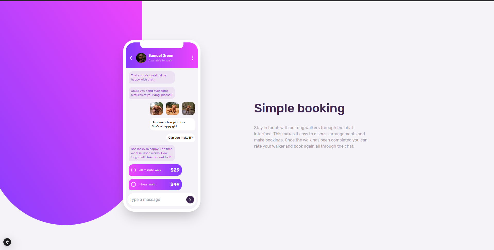

# Frontend Mentor - Chat app CSS illustration solution

This is a solution to the [Chat app CSS illustration challenge on Frontend Mentor](https://www.frontendmentor.io/challenges/chat-app-css-illustration-O5auMkFqY). Frontend Mentor challenges help you improve your coding skills by building realistic projects.

## Overview

### The challenge

Users should be able to:

- View the optimal layout for the component depending on their device's screen size

### Screenshot

### Links

- Solution URL: [solution](https://github.com/adel-bouras/front_chat_app_on_mobile)
- Live Site URL: [github project](https://front-chat-app-on-mobile.vercel.app/)

## My process

### Built with

- Semantic HTML5 markup
- CSS custom properties
- Flexbox
- Mobile-first workflow
- tailwind - For styles
- [React](https://reactjs.org/) - JS library
- [Next.js](https://nextjs.org/) - React framework
